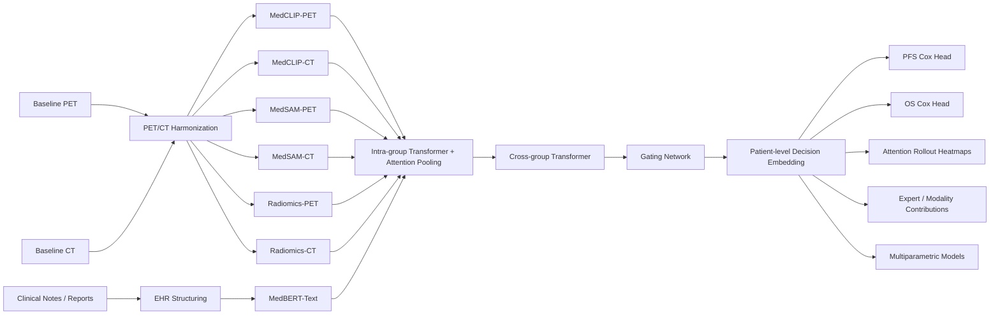

<div align="center">

# Interpretable Multimodal PET/CT-EHR MoE for MCL

**A manuscript-aligned, demo-ready PyTorch implementation for interpretable prognostic modeling in mantle cell lymphoma**

<p>
  
  
  
  
  
</p>

</div>

---

## Project Overview

This repository presents a **self-contained demonstration implementation** of the multimodal framework described in the manuscript:

> **Interpretable Multimodal PET/CT-EHR Fusion via Mixture-of-Experts for Prognostic Stratification in Mantle Cell Lymphoma**

The repository focuses on **architectural faithfulness** to the manuscript:

- PET/CT preprocessing with harmonization and registration
- EHR structuring into sentence-level, time-aware tokens
- Seven expert groups spanning PET, CT, radiomics, and clinical text
- Two-stage hierarchical attention-based **mixture-of-experts (MoE)** fusion
- Independent **PFS** and **OS** Cox-style survival heads
- Interpretable outputs including attention rollout, gating contributions, and modality ablation
- Downstream **multiparametric models** combining R-signatures with PET and clinical factors

This is a **demo-oriented open-source implementation**, not a reproduction package for the manuscript's published performance metrics.

---

## Why This Repository Exists

The manuscript proposes an interpretable framework that jointly models:

- **PET** for metabolic heterogeneity
- **CT** for morphology and structural context
- **EHR text** for clinically meaningful semantic information

Most public examples of multimodal oncology modeling either use simple concatenation or omit interpretability. This repository instead demonstrates a full **hierarchical expert fusion pipeline** with explicit intermediate representations and clinician-facing interpretability hooks.

---

## Architecture at a Glance



---

## Manuscript-Aligned Design

### 1. Multimodal preprocessing

- PET and CT are resampled to a shared voxel grid
- PET is represented in SUV-style intensity space and normalized for downstream learning
- PET is aligned to CT through affine registration driven by normalized mutual information
- Clinical text is de-identified, segmented, section-tagged, negation-tagged, and time-aware

### 2. Seven expert groups

The manuscript describes seven expert-specific feature groups. This repository implements all seven:

| Group | Input | Intended Role |
|---|---|---|
| `MedCLIP-PET` | PET axial slices | high-level metabolic semantics |
| `MedCLIP-CT` | CT axial slices | high-level anatomic semantics |
| `MedSAM-PET` | PET + lesion-aware cues | morphology-sensitive PET representation |
| `MedSAM-CT` | CT + lesion-aware cues | morphology-sensitive CT representation |
| `Radiomics-PET` | PET VOI slices | handcrafted metabolic features |
| `Radiomics-CT` | CT VOI slices | handcrafted structural features |
| `MedBERT-Text` | structured clinical sentences | text semantics and clinical context |

### 3. Hierarchical MoE fusion

The fusion module follows the manuscript's two-stage structure:

- **Intra-group aggregation**: each expert group is contextualized by a lightweight Transformer and pooled by learned attention
- **Inter-group mixture**: refined group vectors interact through a second Transformer, then a gating network produces adaptive expert weights

### 4. Survival modeling

Two independent endpoint-specific models are included:

- **PFS model**
- **OS model**

Each endpoint has its own fusion stack and linear Cox-style risk head, matching the manuscript's task-specific design.

### 5. Multiparametric modeling

The manuscript further combines learned R-signatures with PET and clinical factors. This repository includes that downstream layer:

- **PFS multiparametric model**: `R-signature + TLG + WBC + Ki-67`
- **OS multiparametric model**: `R-signature + TLG + β2-microglobulin`

---

## Interpretability

Interpretability is treated as a first-class output rather than an afterthought.

The current implementation provides:

- **Attention rollout** for slice-level importance maps
- **Volume heatmaps** projected back onto PET/CT
- **Inter-group gating weights** to quantify expert contribution
- **Modality-level contribution summaries** for PET, CT, and EHR
- **Expert ablation** to inspect performance sensitivity
- **Subtype-linked risk summaries** for histopathologic interpretation

This design reflects the manuscript's emphasis on clinically coherent and biologically meaningful explanations.

---

## What Is Real in This Repo, and What Is Lightweight

This repository is intentionally built to be **runnable without downloading large medical foundation model weights**.

### Included directly

- End-to-end data flow
- PET/CT registration and structuring pipeline
- Seven-group feature interface
- Hierarchical attention-based MoE fusion
- Cox loss and dual-endpoint heads
- Interpretability outputs
- Multiparametric risk layer

### Intentionally lightweight

- `MedCLIP`, `MedSAM`, and `MedBERT` are represented by **compatible placeholder modules**
- The code demonstrates the **model contract and tensor flow**, not pretrained clinical performance
- The demo uses **synthetic PET/CT volumes and synthetic structured clinical text**

This makes the repository suitable for:

- code review
- architectural demonstration
- method presentation
- future replacement with real pretrained medical backbones

---

## Repository Layout

```text
.
├── demo.py
├── requirements.txt
└── mcl_multimodal_moe
    ├── __init__.py
    ├── config.py
    ├── data.py
    ├── experts.py
    ├── fusion.py
    ├── interpretability.py
    ├── multiparametric.py
    ├── preprocessing.py
    └── survival.py
```

### Core modules

- `preprocessing.py`: PET/CT harmonization, affine registration, VOI generation, PET metrics, EHR structuring
- `experts.py`: seven expert groups and shared embedding projection
- `fusion.py`: hierarchical Transformer-based MoE fusion
- `survival.py`: dual endpoint-specific survival heads with Cox loss
- `multiparametric.py`: manuscript-style downstream risk models
- `interpretability.py`: attention rollout, modality contribution, ablation, risk summary
- `demo.py`: fully runnable end-to-end demonstration

---

## Quick Start

### 1. Install dependencies

```bash
pip install -r requirements.txt
```

### 2. Run the demo

```bash
python demo.py
```

### 3. Expected output

The demo prints:

- PFS and OS risk scores
- Cox losses
- PET metabolic metrics such as `SUVmax`, `TMTV`, and `TLG`
- expert gating weights
- modality contribution summaries
- attention-driven slice importance
- multiparametric model outputs

Example:

```text
=== Multitask MCL PET/CT-EHR MoE Demo ===
PET batch shape: (2, 24, 96, 96)
PET SUV batch shape: (2, 24, 96, 96)
CT batch shape: (2, 24, 96, 96)
PFS risk scores: [...]
OS risk scores: [...]
PET metrics SUVmax: [...]
PET metrics TMTV: [...]
PET metrics TLG: [...]
```

---

## Open-Source Safe by Design

This repository is prepared for public demonstration:

- no real patient data are bundled
- no hospital-specific tables are embedded in the code
- no external credentials or local absolute paths are required
- demo inputs are synthetic
- no large proprietary checkpoint files are included

For public release, it is still recommended to **exclude manuscript drafts containing institutional, funding, or authorship metadata** if an anonymous or fully neutral repository is desired.

---

## Limitations

- This repository does **not** reproduce the manuscript's reported metrics out of the box
- The medical foundation model backbones are placeholders, not released pretrained checkpoints
- The VOI and preprocessing steps are implemented for demonstration and interface consistency, not as a substitute for physician-reviewed clinical workflows
- Outputs from the demo are **not for clinical decision-making**

---

## How To Extend

This codebase is intentionally structured so real components can be swapped in later:

- replace lightweight vision experts with actual `MedCLIP` encoders
- replace morphology placeholder logic with real `MedSAM` embeddings
- replace text placeholder logic with an actual medical language model
- connect real NIfTI or DICOM loaders
- load trained endpoint-specific weights
- export attention maps and gating summaries into figures for presentation

---

## Recommended Citation

If you use this repository as a reference implementation, cite the associated manuscript and clearly state that this repository is a **demonstration-oriented implementation aligned with the manuscript architecture**.

---

## Disclaimer

This repository is intended for **research presentation, open-source demonstration, and engineering reference**. It is **not a medical device**, **not clinically validated**, and **must not be used for patient care or treatment decisions**.
