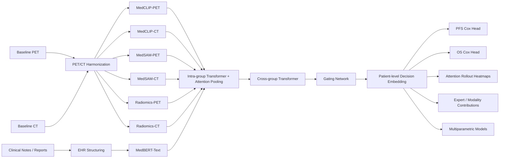

# Interpretable Multimodal PET/CT-EHR MoE for MCL

**PyTorch implementation for interpretable prognostic modeling in mantle cell lymphoma**

  
  
  
  
  

---

## Project Overview

This repository presents the implementation of the multimodal framework:

> **Interpretable Multimodal PET/CT-EHR Fusion via Mixture-of-Experts for Prognostic Stratification in Mantle Cell Lymphoma**

- PET/CT preprocessing with harmonization and registration
- EHR structuring into sentence-level, time-aware tokens
- Seven expert groups spanning PET, CT, radiomics, and clinical text
- Two-stage hierarchical attention-based **mixture-of-experts (MoE)** fusion
- Independent **PFS** and **OS** Cox-style survival heads
- Interpretable outputs including attention rollout, gating contributions, and modality ablation
- Downstream **multiparametric models** combining R-signatures with PET and clinical factors

---

An interpretable framework is proposed that jointly models:

- **PET** for metabolic heterogeneity
- **CT** for morphology and structural context
- **EHR text** for clinically meaningful semantic information

Most public examples of multimodal oncology modeling either use simple concatenation or omit interpretability. This repository instead demonstrates a full **hierarchical expert fusion pipeline** with explicit intermediate representations and clinician-facing interpretability hooks.

---

## Architecture at a Glance

---

## Design

### 1. Multimodal preprocessing

- PET and CT are resampled to a shared voxel grid
- PET is represented in SUV-style intensity space and normalized for downstream learning
- PET is aligned to CT through affine registration driven by normalized mutual information
- Clinical text is de-identified, segmented, section-tagged, negation-tagged, and time-aware

### 2. Seven expert groups

seven expert-specific feature groups:

| Group | Input | Intended Role |
|---|---|---|
| `MedCLIP-PET` | PET axial slices | high-level metabolic semantics |
| `MedCLIP-CT` | CT axial slices | high-level anatomic semantics |
| `MedSAM-PET` | PET + lesion-aware cues | morphology-sensitive PET representation |
| `MedSAM-CT` | CT + lesion-aware cues | morphology-sensitive CT representation |
| `Radiomics-PET` | PET VOI slices | handcrafted metabolic features |
| `Radiomics-CT` | CT VOI slices | handcrafted structural features |
| `MedBERT-Text` | structured clinical sentences | text semantics and clinical context |

### 3. Hierarchical MoE fusion

The fusion module follows the two-stage structure:

- **Intra-group aggregation**: each expert group is contextualized by a lightweight Transformer and pooled by learned attention
- **Inter-group mixture**: refined group vectors interact through a second Transformer, then a gating network produces adaptive expert weights

### 4. Survival modeling

Two independent endpoint-specific models are included:

- **PFS model**
- **OS model**

Each endpoint has its own fusion stack and linear Cox-style risk head.

### 5. Multiparametric modeling

Learned R-signatures with PET and clinical factors are further combined.

- **PFS multiparametric model**: `R-signature + TLG + WBC + Ki-67`
- **OS multiparametric model**: `R-signature + TLG + β2-microglobulin`

---

## Interpretability

Interpretability is treated as a first-class output rather than an afterthought.

The current implementation provides:

- **Attention rollout** for slice-level importance maps
- **Volume heatmaps** projected back onto PET/CT
- **Inter-group gating weights** to quantify expert contribution
- **Modality-level contribution summaries** for PET, CT, and EHR
- **Expert ablation** to inspect performance sensitivity
- **Subtype-linked risk summaries** for histopathologic interpretation

This design reflects emphasis on clinically coherent and biologically meaningful explanations.
